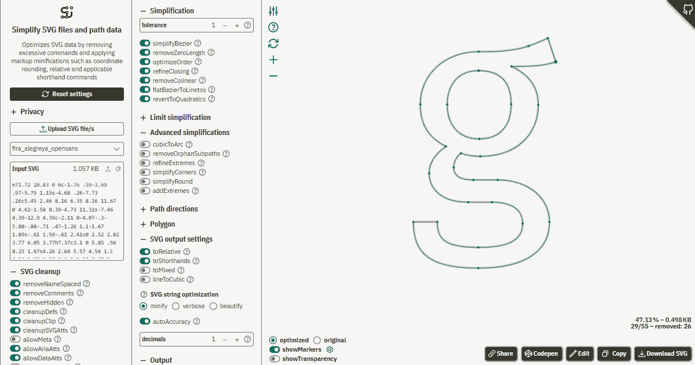

[](https://www.npmjs.com/package/svg-path-simplify)
[](https://www.npmjs.com/package/svg-path-simplify)
[](https://cdn.jsdelivr.net/npm/svg-path-simplify@latest/dist/svg-path-simplify.min.js)
[](https://www.unpkg.com/svg-path-simplify@latest/dist/svg-path-simplify.js)

<div align="center" style="text-align:center">

<h1 align="center">svg-path-simplify</h1>
<p align="center">Simplify Bézier paths while keeping shape</p>
</div>   


## *Watch the curve, not the file size!*   
While this library reduces SVG markup sizes significantly by removing commands it prioritizes **visual quality** over numeric compression gains.
Unlike most existing approaches (e.g in graphic applications), it checks where simplifications are suitable and stops simplification at the right »point« (literally).

    
*Fira Sans (based on truetype/glyph quadratic commands) converted to cubic Béziers. Left:Original; Right:optimized*

## Features 
### Path simplification
* reduces the number of SVG commands (both Béziers and lines) by converting/combining adjacent:  
  * Béziers (`C`, `Q`)
  * flat Béziers to Linetos
  * colinear lines (`L`)
  * converts cubic Béziers which can be expressed as more compact quadratic

* reorders path starting points to replace unnecessary closing linetos by `Z` commands
* optimizes SVG file size by contextually converting to:  
  * shorthand commands (`C` => `S`, `Q` => `T`, `L`=>`H` or `V`)
  * cubics to quadratic Béziers  (only 1 control point)
  * cubic arc-like segments to `A` (elliptic arc) and `rx`, `ry` radii optimization for semi-circle segments

### Multiple input formats
For more convenience pretty much any vector input are supported:
* stringified `d` path data for single paths
* SVG2 pathData arrays (parsed via `getPathData()`)
* XML markup for complete SVG files
* polygon/polyline data provided as point object array, nested array or string

### Coordinate rounding
* adaptive coordinate rounding: small or large details can be auto-detected to find a suitable floating point accuracy without guessing the decimal value (3 decimals may not be the silver bullet=)
* quantized half-decimal rounding

### SVG optimization
Cleanup for:  
* meta data
* namespaced attributes or elements 
* convert `xlink:href` to `href` and vice-versa 
* move `defs` to the top 
* remove futile `<clipPath>` defs spanning across the entire viewBox
* convert styles to presentation attributes

### Shape conversions
* convert shapes such as `<circle>`, `<ellipse>`, `<rect>` etc. to `<path>` – supports relative `%` or physical units like `mm`
* convert paths to shapes – if applicable

### Polygons
* convert paths to polygons
* reduce poly vertices
* convert/smooth polygons to curved path data

### Transforms
* convert transforms to hard-coded path data
* scale SVGs to desired output size

### Path directions
* reverse path drawing directions
* auto-fix compound path directions to comply with non-zero fill rules

### Additional features
* split segments at extremes – only useful for manual editing
* optimize either path data strings or SVG markup code
* create curves from polylines (curve-fitting)


## TOC
* [Usage](#usage)
  + [Browser](#browser)
    - [Example 1: parse and simplify (using defaults)](#example-1-parse-and-simplify-using-defaults)
    - [ESM version](#esm-version)
  + [node.js](#nodejs)
    - [Example 2: Apply options](#example-2-apply-options)
  + [Web worker](#web-worker)
* [API](#api)
* [Lite version](#lite-version--only-path-data)
* [Demos](#demos)
  + [Web app](#web-app)
  + [Demo files](#demo-files)
* [Limitations](#limitations)
  + [Optimization of complete SVG files](#optimization-of-complete-svg-files)
  + [»Natural« limitations of vector/curve simplification](#natural-limitations-of-vectorcurve-simplification)
  + [The sad truth about »gigantic« SVG files](#the-sad-truth-about-gigantic-svg-files)
* [Changelog, Updates and rollback](#changelog-updates-and-rollback)
  + [Changelog](#changelog)
  + [Rollback](#rollback)
* [Bug reporting](#bug-reporting)
* [Related  libraries](#related-libraries)
* [Other SVG related projects](#other-svg-related-projects)
* [Credits](#credits)


## Usage 

### Browser 

#### Example 1: parse and simplify (using defaults)
```html
<script src="https://cdn.jsdelivr.net/npm/svg-path-simplify@latest/dist/svg-path-simplify.min.js"></script>
```

```js
let pathDataString = 
`
M 57.13 15.5
c 13.28 0 24.53 8.67 28.42 20.65
c 0.94 2.91 1.45 6.01 1.45 9.23
`

// try to simplify
let pathDataOpt = svgPathSimplify(pathDataString);

// simplified pathData
console.log(pathDataOpt)
// returns `M 57.1 15.5c16.5 0 29.9 13.4 29.9 29.9`
```

#### ESM version

```js  
import { svgPathSimplify } from '../dist/svg-path-simplify.esm.min.js'

let pathDataString =
`
M 57.13 15.5
c 13.28 0 24.53 8.67 28.42 20.65
c 0.94 2.91 1.45 6.01 1.45 9.23
`

// try to simplify
let pathDataOpt = svgPathSimplify(pathDataString);

// simplified pathData
console.log(pathDataOpt)
// returns `M 57.1 15.5c16.5 0 29.9 13.4 29.9 29.9`
```

### node.js
Install module via npm:   
```
npm install svg-path-simplify
```

To simplify entire SVG documents in node.js we need to emulate the browsers DOM methods `DOMParser` and `XMLSerializer`. I opted for [linkedom](https://github.com/WebReflection/linkedom). Just make sure to import the `svg-path-simplify/node` module. It will load linkedom's methods `DOMParser` and add a polyfill for `XMLSerializer`

```js 
/**
 * load node polyfills for DOM parsing
 * loads linkedom npm module for DOM parsing and emulation 
 */
import 'svg-path-simplify/node';

// use it as in the above examples
import { svgPathSimplify  } from 'svg-path-simplify';

let pathDataString =  `M 57.13 15.5c 13.28 0 24.53 8.67 28.42 20.65c 0.94 2.91 1.45 6.01 1.45 9.23`;
let pathDataOpt = svgPathSimplify(pathDataString);
```

### Web worker
Similar to node.js usage we need [linkedom](https://github.com/WebReflection/linkedom) to polyfill missing DOMParser functionality in a headless environment.

```js
import './svg-path-simplify.worker.polyfills.js';
import { svgPathSimplify } from './svg-path-simplify.esm.js';
```

Import the polyfill module from the dist folder. It imports the worker version of linkedom.
See [svg-path-simplify.worker.js](https://github.com/herrstrietzel/svg-path-simplify/blob/main/dist/svg-path-simplify.worker.js).  


#### Example 2: Apply options  
The following example would return a detailed object containing the stringified "normalized" pathdata (all absolute and "longhand" command notation). 

```js 
let options = {
 extrapolateDominant: false,
 decimals: 3,
 toRelative: false,
 toShorthands = false,
 minifyD: 2,
 getObject: true
}

let input = `M717 208c-35 12-74 14-135 14 54 25 82 64 82 117 0 93-68 157-177 157-21 0-40-3-59-9-14 10-22 27-22 43 0 26 20 38 60 38h74c93 0 158 55 158 128 0 90-75 141-217 141-149 0-198-44-198-141h73c0 56 25 77 125 77 97 0 135-23 135-71 0-44-34-66-93-66h-73c-78 0-119-38-119-88 0-30 18-59 51-82-54-28-78-68-78-128 0-93 78-161 178-161 73 1 120-6 152-17 16-6 36-14 60-24zm-235 27c-61 0-96 41-96 103s36 105 98 105 97-39 97-106-33-102-99-102z`;

let simplified = svgPathSimplify(input, options);
let {svg, d, report} = simplified;

console.log(simplified)

/*
// returns 
{
"svg": "",
"d": "M 717 208
C 682 220 643 222 582 222
C 636 247 664 286 664 339
C 664 432 596 496 487 496
C 466 496 447 493 428 487
C 414 497 406 514 406 530
C 406 556 426 568 466 568
L 540 568
C 633 568 698 623 698 696
C 698 786 623 837 481 837
C 332 837 283 793 283 696
L 356 696
C 356 752 381 773 481 773
C 578 773 616 750 616 702
C 616 658 582 636 523 636
L 450 636
C 372 636 331 598 331 548
C 331 518 349 489 382 466
C 328 438 304 398 304 338
C 304 245 382 177 482 177
C 555 178 602 171 634 160
C 650 154 670 146 694 136
Z 
M 482 235
C 421 235 386 276 386 338
C 386 400 422 443 484 443
C 546 443 581 404 581 337
C 581 270 548 235 482 235
Z 
",
 "report": {
  "original": 29,
  "new": 29,
  "saved": 0,
  "compression": 148.46,
  "decimals": 0
 },
 "inputType": "pathDataString",
 "mode": 0
}
*/
```


## API

```js 
let options = {}
let output = svgPathSimplify(input, options);
```

The first parameter is the SVG input:  
* a path data string – as used in SVG `<path>` element's  `d` attribute
* a polygon string – as used in SVG `<polygon>` element's  `points` attribute
* an entire `<svg>` markup

While svg-path-simplify aims at a convenient usage with effective and safe defaults you can tweak the simplification and output via these options passed as an object.    

See [documentation for complete list of parameters](docs/api.md)


## Lite version – only path data
Since the library aims at a complete toolset it might be an overkill for your needs. 
For this use case you can opt for the lighter pathdata only version »svg-path-simplify.pathdata.esm.min«.  Minified filesize is ~41 KB / 17 KB gzipped (compared to the full library with ~72/27 KB)

The API is compatible but simply missing some options such as:  
* polygon smoothing/curve fitting
* svg processing - only path data is allowed 
* no scaling 
* no path direction fixes

```js


import { simplifyPathData } from '../dist/svg-path-simplify.pathdata.esm.js'

let pathDataString =
`
M 57.13 15.5
c 13.28 0 24.53 8.67 28.42 20.65
c 0.94 2.91 1.45 6.01 1.45 9.23
`
// try to simplify
let pathDataOpt = simplifyPathData(pathDataString);

/*
 or with options let pathDataOpt = simplifyPathData(pathDataString, options);
*/

```


## Demos
### Web app
You can easily test this library via the [**webapp**](https://herrstrietzel.github.io/svg-path-simplify/) or by checking the demo folder. 

    

#### Features
* test all provided simplification option - export settings as JS object
* preview different settings 
* accepts SVG files
* path data strings
* supports multi file batch processing
* open results in codepen or svg-path-editor
* download self contained SVG


### Demo files
* [simple setup IIFE](./demo/simple-iife.html)
* [simple setup esm](./demo/simple-esm.html)  
* [codepen](https://codepen.io/herrstrietzel/pen/PwzxpoE)

### Webapp examples
* [font/glyph simplification](https://herrstrietzel.github.io/svg-path-simplify/?samples=fira_alegreya_opensans)


## Limitations 
### Optimization of complete SVG files
This lib's focus is on path data optimizations. While it also provides some basic cleanup options for entire SVG documents (e.g removal of hidden elements or path merging) – if you need a full blown document optimization better opt for [SVGO](https://github.com/svg/svgo) or the GUI [SVGOMG](https://svgomg.net). 
SVGO comes with a plethora of options to remove document overhead like unused definitions like gradients, defs, styles etc.  

### »Natural« limitations of vector/curve simplification
Unlike raster images we can't reduce information in vector graphics in a predictable fashion. While we *can* apply brute force and remove points – it won't work:

We always need to **respect the complexity of a graphic**: if we remove too many segments – we significantly change the appearance.  

**Scaling** down can only help if we're dealing with an either huge or microscopic coordinate space: large numbers vs. small ones requiring too many floating point decimals. For instance scaling down a 100x100 viewBox to 24x24 won't significantly reduce the ultimate file size or even result in larger markup sizes due too more floating point values.

### The sad truth about »gigantic« SVG files  
SVGs > 1 MB are most of the time not salvagable. At least if they contain 10K+ of path data. Quite often their size comes from the complexity itself not from overhead or simplifyable geometries. This is especially true for many CAD exports containing a rubbish structure with way too many separate line elements that can't easily be combined to curves.   

**Recommendation:** If a simplification still doesn't result in a significantly smaller file size or better rendering – a Hi-res raster image is often the only reasonable workaround. Bear in mind, most  rendering pipelines for raster images are more optimized than vector renderers (e.g often benefitting from gpu accelleration) so a 1MB raster image (png, webp, jpeg etc) won't let your renderer scream in agony – a 1MB SVG does!


## Changelog, Updates and rollback
### Changelog
See [changelog.md](https://github.com/herrstrietzel/svg-path-simplify/blob/main/CHANGELOG.md) 


### Rollback
If you encounter any issues with the recent versions you can rollback to a previous version.  
See all versions on 
* [npm](https://www.npmjs.com/package/svg-path-simplify)  
* [jsdelivr](https://www.jsdelivr.com/package/npm/svg-path-simplify)


## Bug reporting
If you found a bug - feel free to file an [issue](https://github.com/herrstrietzel/svg-path-simplify/issues).   
For debugging you may also test your example in the [webapp](https://herrstrietzel.github.io/svg-path-simplify). 
You can also post in the [discussions](https://github.com/herrstrietzel/svg-path-simplify/discussions/) if you have ideas for missing features.


## Related  libraries
* **polygon simplification:** Volodymyr Agafonkin for [»simplify.js«](https://github.com/mourner/simplify-js) 
* **polygon smoothing/curve fitting** [simplify.js](http://paperjs.org/reference/path/#simplify) 

## Other SVG related projects  
* [poly-simplify](https://github.com/herrstrietzel/poly-simplify): Simplify/reduce polylines/polygon vertices in JS
* [svg-getpointatlength](https://github.com/herrstrietzel/svg-getpointatlength): Calculate path lengths, points or angles at lengths based on raw pathdata
* [fix-path-directions](https://github.com/herrstrietzel/fix-path-directions): Correct sub path directions in compound path for apps that don't support fill-rules
* [svg-pathdata-getbbox](https://github.com/herrstrietzel/svg-pathdata-getbbox): Calculate a path bounding box based on its pathdata


## Credits
* [Yqnn](https://github.com/Yqnn?tab=repositories) for creating the indispensible tool [»svg-path-editor«](https://yqnn.github.io/svg-path-editor) – a must-bookmark for visual SVG debugging!
* [Vitaly Puzrin](https://github.com/puzrin) for [svgpath library](https://github.com/fontello/svgpath) providing for instance a great and customizable [arc-to-cubic approximation](https://github.com/fontello/svgpath/blob/master/lib/a2c.js) – the base for the more accurate arc-to-cubic approximations
* [Jarek Foksa](https://github.com/jarek-foksa) for developping the great [getPathData() polyfill](https://github.com/jarek-foksa/path-data-polyfill) – probably the most productive contributor to the ["new" W3C SVGPathData interface draft](https://svgwg.org/specs/paths/#InterfaceSVGPathData)
* obviously, [Dmitry Baranovskiy](https://github.com/dmitrybaranovskiy) – a lot of these helper functions originate either from Raphaël or snap.svg – or are at least heavily inspired by some helpers from these libraries
* [Andrea Giammarchi a.k.a WebReflection](https://github.com/WebReflection) for [linkedom](https://github.com/WebReflection/linkedom) which helped to make this lib run also in node or a web worker
* [Photopea](https://github.com/photopea) for the fast [UZIP](https://github.com/photopea/UZIP.js) which is deployed in the webapp for batch file downloads.
* [mdpjs](https://github.com/UmemotoCtrl/mdpjs) for the great JS markdown parser (used in the web app)

